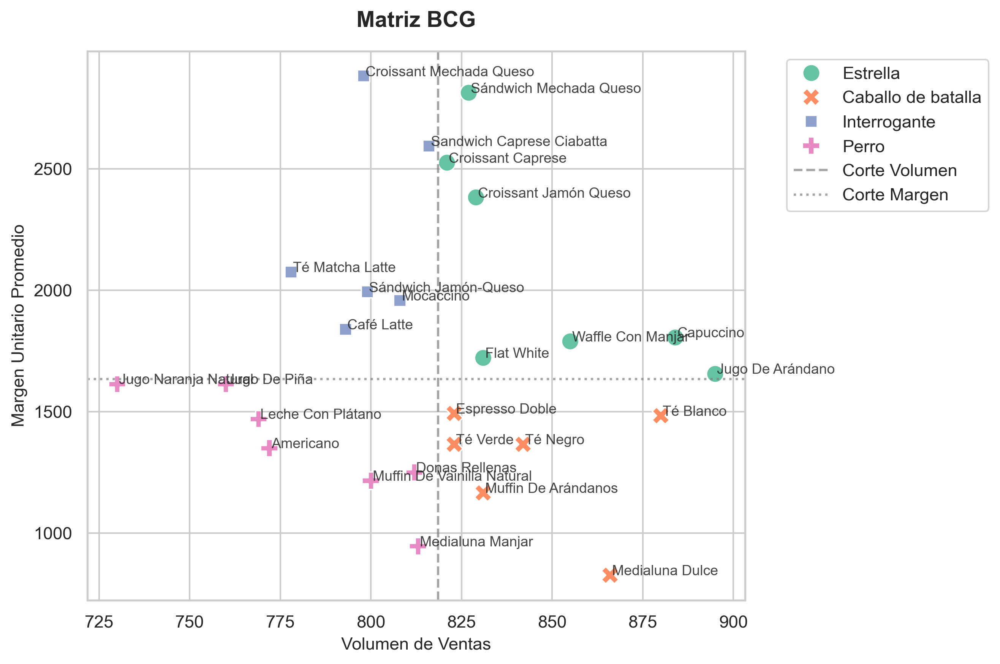
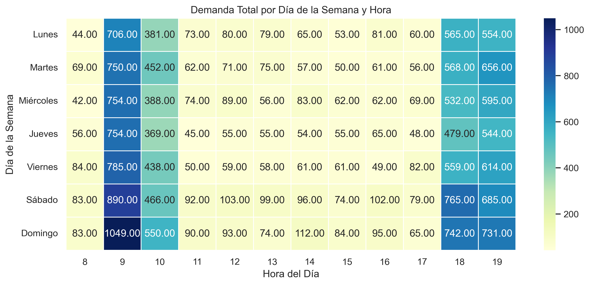
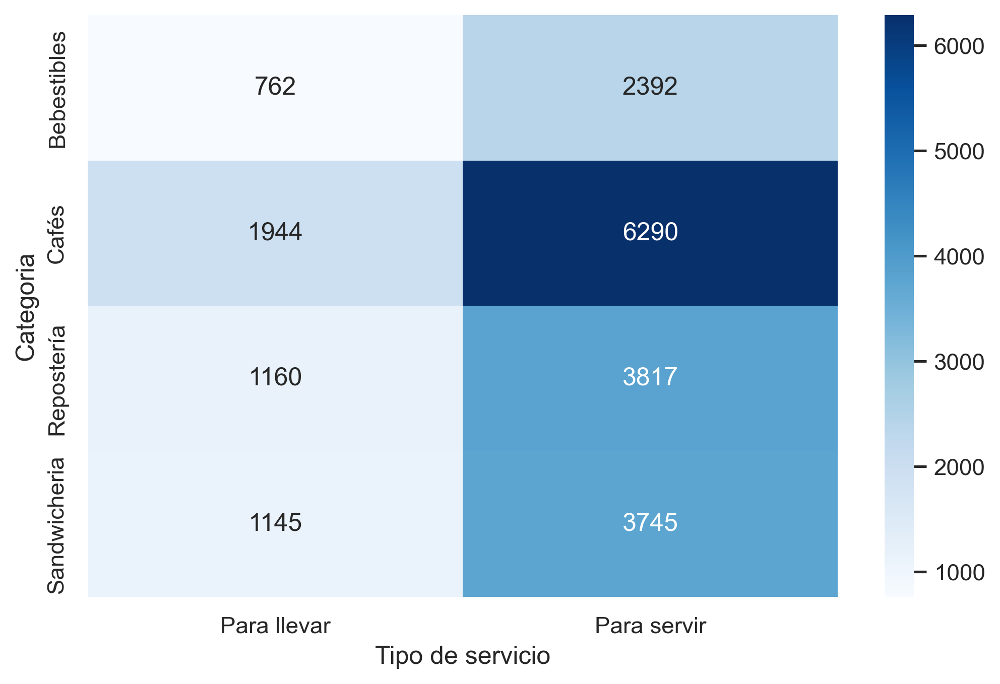
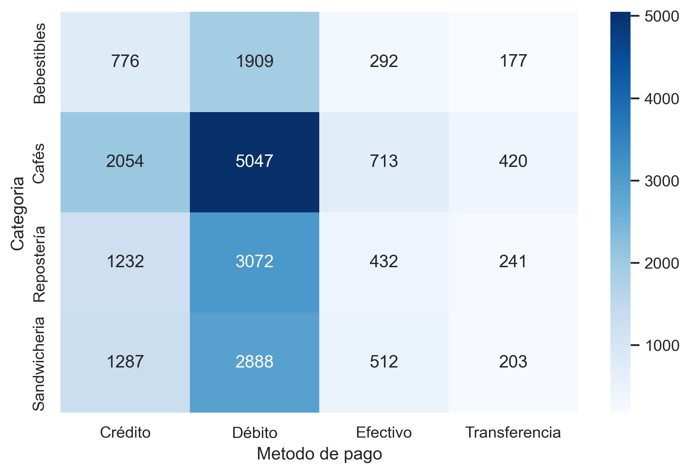

# ☕ Coffee Shop Dashboard & Analysis

A comprehensive data analysis of sales performance and customer behavior focused on optimizing the business strategy and profitability of a coffee shop using Python and Power BI.

---

## 2. Badges


---

## 3. Table of Contents

1. [Key Features / Objectives](#4-key-features--objectives)
2. [Architecture / Repository Structure](#5-architecture--repository-structure)
3. [Prerequisites and Installation](#6-prerequisites-and-installation)
4. [Usage Guide / Quick Examples](#7-usage-guide--quick-examples)
5. [Technologies Used](#8-technologies-used)
6. [Results / Demo](#9-results--demo-screenshots--gifs)
7. [License and Credits / Author](#10-license-and-credits--author)

---

## 4. Key Features / Objectives

* **Exploratory Data Analysis (EDA):** Data cleaning, aggregation, and identification of purchasing patterns and peak sales hours.
* **Strategic Segmentation:** Product classification using a **BCG Matrix** (Stars, Workhorses/Cash Cows, Question Marks, and Dogs) to guide menu and pricing decisions.
* **Co-occurrence Analysis:** Identification of frequent product combinations (cross-selling) to develop product bundling strategies.
* **Interactive Visualization:** Creation of a dynamic Power BI Dashboard to track key business KPIs.

---

## 5. Architecture / Repository Structure

```text
dashboard-and-analysis-coffeeshop/
├── data/
│   ├── raw/                # Original unprocessed data
│   └── processed/          # Clean data ready for Power BI
├── notebooks/
│   ├── 01_cleaning_coffeeshop.ipynb  # EDA and Data Cleaning
│   └── 02_bcg_and_cooccurrence.ipynb # BCG Matrix and Co-occurrence Analysis
├── dashboard/
│   └── 03_dashboard_cafeteria.pbix  # Interactive Power BI report
├── assets/                 # Images and GIFs for README
├── src/
│   └── README.md
├── .gitignore
├── LICENSE
├── README.md
└── requirements.txt
```

---

## 6. Prerequisites and Installation

### Prerequisites
* **Python 3.10+**
* **Power BI Desktop** (to open and view the `.pbix` file)

### Installation

1. Clone the repository:
   ```bash
   git clone https://github.com/oscararayaoad-sys/dashboard-and-analysis-coffeeshop.git
   cd dashboard-and-analysis-coffeeshop
   ```

2. Create a virtual environment and install dependencies:
   ```bash
   python -m venv venv
   source venv/bin/activate  # On Windows: venv\Scripts\activate
   pip install -r requirements.txt
   ```

---

## 7. Usage Guide / Quick Examples

1. **Run the data pipeline (EDA / Processing):**
   ```bash
   jupyter notebook notebooks/01_cleaning_cafeteria.ipynb
   ```
2. **Open the Dashboard:**
   Navigate to the `dashboard/` directory and open `03_dashboard_cafeteria.pbix` directly in **Power BI Desktop**.

---

## 8. Technologies Used

* **Language:** Python 3.10+
* **Data Analysis:** Pandas, NumPy
* **Data Visualization:** Seaborn, Matplotlib
* **Business Intelligence:** Microsoft Power BI (DAX, Power Query)

---

## 9. Results / Demo (Screenshots / GIFs)

### 📊 Interactive Dashboard (Power BI)

> *Demonstration of the dynamic control panel in Power BI for monitoring sales and business KPIs.*

| Dashboard Interactivity |
| :---: |
|  |
*(If you don't have a GIF, replace this path with a `.png` or `.jpg` screenshot of your dashboard)*

---

### 🔍 Key Findings from Data Analysis (Python / Seaborn)

Exploratory data analysis revealed critical insights for commercial decision-making:

| BCG Matrix (Portfolio) | Heatmap: Hour vs. Day |
| :---: | :---: |
|  |  |
| **Strategic Segmentation:** Classification of products by unit margin and sales volume (*Stars*, *Workhorses*, *Question Marks*, and *Dogs*). | **Peak Hours:** Clear identification of high-demand times (notably 09:00 AM every day) to optimize staff scheduling. |

| Service Type by Category | Preferred Payment Methods |
| :---: | :---: |
|  |  |
| **Consumption Preference:** Massive preference for *"Dine-in"* over *"Takeaway"*, particularly across Coffee and Bakery categories. | **Financial Behavior:** Debit card is the primary payment method across all categories, followed by Credit card. |

---

## 10. License and Credits / Author

* **License:** Distributed under the MIT License. See `LICENSE` for details.
* **Author:** Oscar Araya ([@oscararayaoad-sys](https://github.com/oscararayaoad-sys))
